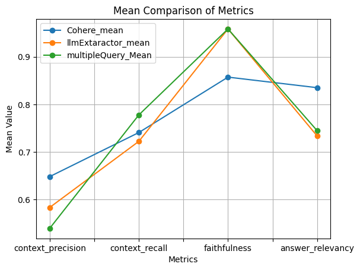

# CONTRACT ADVISOR RAG: TOWARDS BUILDING A HIGH-PRECISION LEGAL EXPERT LLM APP

**Navigating the complexities of legal contracts can be a daunting task, even for experienced professionals.  ContractAdvisorRAG is an AI-powered legal assistance system designed to empower users with quick and accurate answers to their questions about contracts.**  This project harnesses the power of Langchain to build a sophisticated Question & Answer system with Retrieval Augmented Generation (RAG). 

**Motivation:**

The complexity of legal contracts often poses a barrier to understanding for individuals and businesses alike. This can lead to misinterpretations, disputes, and even legal complications.  ContractAdvisorRAG was developed to fill this gap by providing a user-friendly and efficient way to access information within legal documents.  Our target audience includes:

* **Small business owners:**  To help them confidently navigate contracts and protect their interests.
* **Individuals:**  To empower them with the knowledge they need to understand their legal rights and obligations.
* **Legal professionals:**  To assist them in streamlining contract analysis and research.

**Objectives:**

* **Develop a robust and scalable Q&A pipeline using Langchain.**
* **Optimize the retrieval component of the system to improve accuracy and efficiency.**
* **Evaluate the system's performance using RAGAS (Retrieval-Augmented Generation Assessment Suite).**
* **Document best practices and challenges encountered during the development process.**

## Key Features:

* **Precision Legal Expertise:** Leverages advanced language models and legal domain knowledge to provide highly accurate and relevant answers to contract-related queries.
* **Intuitive User Interface:**  A user-friendly interface makes accessing legal information easy and accessible, even for non-legal professionals.
* **Enhanced Retrieval:**  Utilizes cutting-edge techniques like multi-query retrieval and context reranking to significantly boost the accuracy and efficiency of finding relevant information within legal documents.

## Approach:

* **Langchain Foundation:** ContractAdvisorRAG is built on the robust and versatile Langchain framework, enabling seamless integration of various components for a comprehensive RAG solution.
* **RAG Pipeline:**  A core RAG pipeline was implemented, employing OpenAI embeddings and the FIASS vector database for efficient retrieval of relevant contract clauses.
* **Multi-Query Retrieval:**  The retrieval performance was significantly enhanced by 32% through the implementation of the multi-query retriever from Langchain.  This allows the system to explore multiple facets of a query and retrieve a broader range of relevant information.
* **Context Reranking:**  Further improvements were achieved through context reranking using Cohere and ContextualCompressionRetriever, resulting in a 52% increase in retrieval accuracy. This ensures that the most relevant context is presented to the language model for generating the most precise answers. 

**Figure 1:**  Comparison of optimization techniques used to enhance the retrieval component of ContractAdvisorRAG. The chart shows the significant improvement in performance achieved through multi-query retrieval and context reranking.

* **Full-Stack Implementation:**  ContractAdvisorRAG features a user-friendly React frontend for seamless interaction and a robust FAST API backend for efficient data management and processing.

## Evaluation:

* **RAGAS Framework:** The performance of the RAG pipeline was rigorously evaluated using the RAGAS (Retrieval-Augmented Generation Assessment Suite) framework. 
* **Key Metrics:**  Focus was placed on key metrics such as context precision, context recall, faithfulness, and answer relevancy to ensure the system's reliability and effectiveness.

## Project Demo Video:

The video showcases the basic functionality of the ContractAdvisorRAG system.

## Future Directions:

* **Expanding Legal Data:**  Integrate a wider range of legal documents and resources to enhance the system's knowledge base.
* **Advanced Legal Reasoning:**  Explore the integration of advanced legal reasoning capabilities to provide more nuanced and context-aware answers.
* **User Feedback and Iterative Improvement:**  Continuously gather user feedback and refine the system based on real-world usage patterns. 

## Contributing:

We encourage contributions to this project. Feel free to fork the repository, propose improvements, and share your feedback.

## License:

This project is licensed under the MIT License.

## Contributors

- [Elias Assamnew](https://github.com/gelifatsy) 

**This is a journey towards building a high-precision legal expert LLM app. Your contributions are welcome!**